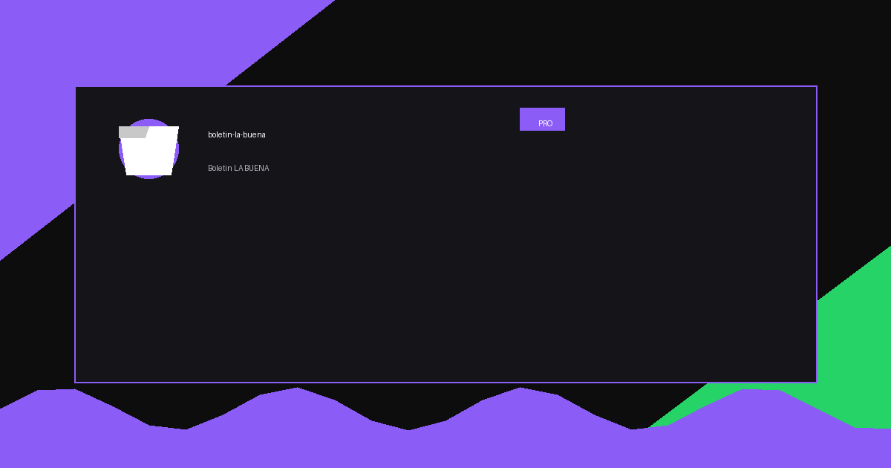

# 🛰️ Boletín LA BUENA — Situational Awareness Edition v3

> **v3.2 — Nota de seguridad (30-ago-2026):** se eliminó un token de GitHub que estaba hardcodeado en el código.
> El repositorio fue reescrito (historial limpio) y ahora corre en **modo demo público**: sin datos personales
> (panel de salud/medicamentos e hijo desactivados). La versión personal completa vive en el VPS de Óscar,
> protegida con contraseña y conectada a Nexus. Si usas el sync de GitHub, pega TU token en ⚙️ → Prefs
> (se guarda solo en tu navegador).
<p align="center">
  
</p>


> Dashboard personal de conciencia situacional para La Paz, BCS.
> Funde el seguimiento diario de **Boletín LA BUENA** con las capacidades OSINT e inteligencia situacional de **[World Monitor](https://github.com/koala73/worldmonitor)**.

---

## 🖥️ Vista general

Un HUD (Heads-Up Display) personal y profesional que integra:

| Panel | Descripción |
|---|---|
| 🛰️ **Intel Situacional** | Feeds RSS globales clasificados por señal: economía, seguridad, clima, pesca, política y tecnología |
| 🗺️ **Mapa BCS** | Mapa interactivo oscuro centrado en Baja California Sur con puntos de interés, zonas de pesca y rutas (Leaflet + CARTO Dark) |
| 🌤️ **Clima** | Datos en tiempo real de Open-Meteo para La Paz, CDMX y Puerto Escondido |
| 🐟 **Índice de Pesca** | Algoritmo propio basado en viento, UV y temperatura para calificar condiciones en el Mar de Cortés |
| 💱 **Forex / Cripto** | USD/MXN en tiempo real + precios de Bitcoin, Ethereum, Solana y DOGE via CoinGecko |
| 📰 **Noticias** | Feed de economía, cripto-noticias y tecnología via rss2json |
| 📖 **Espiritualidad** | Versículo diario (RVR1960) + acción espiritual rotativa |
| 💊 **Salud & Hábitos** | Seguimiento personal de medicamentos y hábitos con estado diario persistente |
| 🏍️ **Ruta en Moto** | Ruta sugerida basada en condiciones climáticas (Italika FT150 TS) |
| ✔️ **Checklist** | Lista diaria persistente por fecha con reinicio automático |
| 💖 **Panel de Hijo** | Modos "estoy con él" / "a distancia" con ventana de comunicación óptima |

---

## 🏗️ Arquitectura

```
boletin-la-buena-upgrade/
├── index.html          # Layout HUD con todas las secciones
├── css/
│   └── style.css       # Tema HUD oscuro · design tokens · responsive
├── js/
│   ├── config.js       # CFG: ciudades, APIs, proyectos, rutas
│   ├── settings.js     # Gestión de preferencias (localStorage)
│   ├── intel_service.js  # ← NUEVO: agregador OSINT / signal classifier
│   └── app.js          # Render y orquestación principal
└── README.md
```

### Flujo de datos

```
Open-Meteo ──────────────┐
CoinGecko ───────────────┤
rss2json (RSS feeds) ─────┤──► intel_service.js ──► Signal Classifier ──► Panel Situacional
Open Exchange Rates ──────┘
bible-api ────────────────────────────────────────────────────────────────► Espiritualidad

Leaflet + CARTO Dark ─────────────────────────────────────────────────────► Mapa BCS
localStorage ─────────────────────────────────────────────────────────────► Settings / Daily
```

---

## ⚙️ Tecnologías

| Tecnología | Uso |
|---|---|
| JavaScript (ES2022, vanilla) | Toda la lógica del dashboard |
| CSS (custom properties + grid) | Tema HUD, design tokens, animaciones |
| Leaflet 1.9.4 | Mapa interactivo (carga dinámica) |
| CARTO Dark Matter tiles | Tiles oscuros tipo intel/HUD |
| Open-Meteo (gratis) | Clima + datos marinos BCS |
| CoinGecko (free tier) | Precios crypto + cambio 24h |
| rss2json API | Normalización de feeds RSS |
| Open Exchange Rates | Tipo de cambio USD/MXN |
| bible-api.com | Versículos RVR1960 |
| localStorage | Persistencia de preferencias y estado diario |

---

## 🗺️ Mapa Situacional

El mapa está centrado en **La Paz, BCS** y carga dinámicamente Leaflet. Incluye:

- 🏠 **Base de operaciones**: La Paz, BCS
- ⚓ **Zona de pesca**: El Mogote
- 🪁 **La Ventana**: spot de kitesurf
- 🏙️ **Todos Santos**: Pueblo Mágico
- ⛏️ **El Triunfo**: pueblo histórico
- 🟦 **Polígono**: Mar de Cortés (zona de pesca activa)

---

## 🔄 IntelService — Clasificador de Señales

El módulo `intel_service.js` agrega feeds y clasifica cada noticia en categorías de señal:

| Señal | Palabras clave detectadas |
|---|---|
| `economic` | inflación, dólar, BANXICO, PIB, mercado, peso |
| `political` | gobierno, presidente, elecciones, decreto |
| `climate` | huracán, tormenta, ciclón, sismo, temperatura |
| `security` | crimen, violencia, ejército, operativo |
| `fishing` | pesca, camarón, veda, CONAPESCA, Mar de Cortés |
| `technology` | IA, ciberseguridad, startup, digital |

Incluye caché de 15 minutos por feed para no saturar las APIs.

---

## 🚀 Uso local

```bash
# Clonar
git clone https://github.com/oscaromargp/boletin-la-buena

# No requiere instalación de dependencias — puro HTML/CSS/JS
# Abrir directamente en navegador:
start index.html

# O con servidor local (evita CORS en algunos navegadores):
npx -y serve .
```

---

## 📦 Despliegue en GitHub Pages

```bash
git add .
git commit -m "feat: Situational Awareness Edition v3 — WorldMonitor fusion"
git push origin main
# GitHub Pages: Settings → Pages → Branch: main → /root
```

---

## 🙏 Créditos

- **[koala73/worldmonitor](https://github.com/koala73/worldmonitor)** — Inspiración arquitectónica para el sistema de inteligencia situacional, clasificación de señales OSINT y el diseño tipo HUD.
- **[Open-Meteo](https://open-meteo.com/)** — API de clima gratuita y abierta.
- **[CoinGecko](https://coingecko.com/)** — API de precios cripto.
- **[Leaflet.js](https://leafletjs.com/)** — Librería de mapas open source.
- **[CARTO](https://carto.com/)** — Tiles cartográficos dark mode.
- **[rss2json](https://rss2json.com/)** — Convertidor de RSS a JSON.

---

## 👤 Autor

**Oscar Omar González Piñuelas** — La Paz, BCS, México  
Dashboard personal de conciencia situacional construido con ❤️

---

> *"Información es poder. Inteligencia situacional es libertad."*


## 💬 Preguntas y Soporte

<p align="center">
  <a href="https://wa.me/526121077805?text=Hola%20Oscar%2C%20vi%20tu%20proyecto%20en%20GitHub%20y%20quisiera%20preguntarte...">
    
  </a>
</p>


## 💖 Apoya este Proyecto

Si este proyecto te fue útil, considera apoyarlo.

> **Dirección XRP**: `rBthUCndKy3Xbb19Ln4xkZeMwusX9NrYfj`


## 📬 Contacto

<p align="center">
  <strong>Oscar Omar Gómez Peña</strong>
</p>

<p align="center">
  <a href="https://oscaromargp.github.io/Oscaromargp/">
    
  </a>
  <a href="https://github.com/oscaromargp">
    
  </a>
  <a href="https://wa.me/526121077805">
    
  </a>
</p>


## 🙏 Agradecimientos

<p align="center">
  <br/>
  <em>
    "Porque Dios es el que en vosotros produce<br/>
    así el querer como el hacer,<br/>
    por su buena voluntad."
  </em>
  <br/>
  <strong>— Filipenses 2:13</strong>
  <br/><br/>
  Todo lo que aquí existe nació primero como un deseo en el corazón.<br/>
  Cada proyecto, cada línea, cada idea que toma forma —<br/>
  es un regalo de Aquel que nos dio tanto el sueño como la fuerza de alcanzarlo.<br/>
  <strong>A Dios, toda la gloria.</strong>
  <br/>
</p>


## 📸 Capturas de pantalla

<p align="center">
  
</p>

> ¿No puedes ver la imagen? [Ver en el navegador](assets/)

